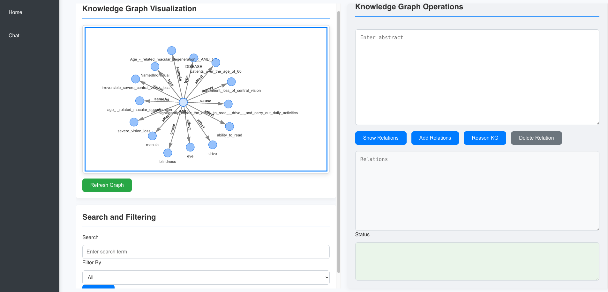
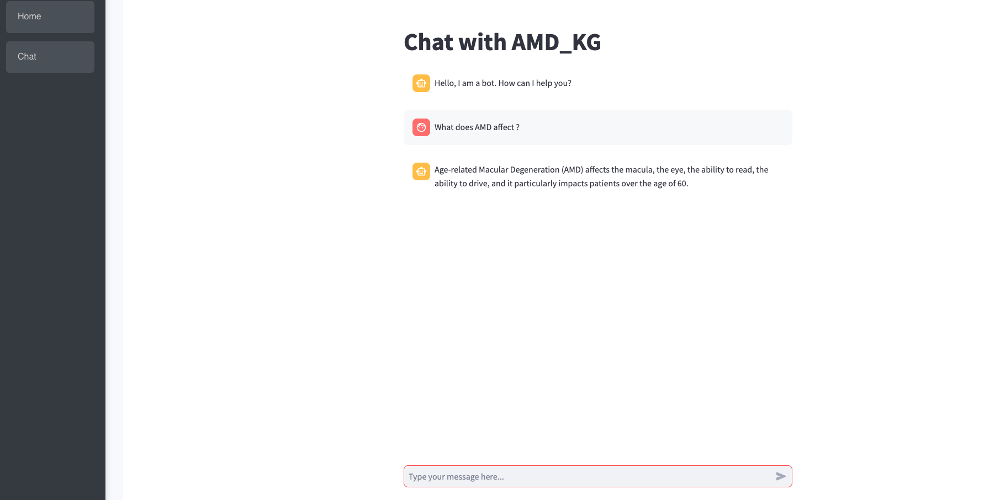

# Introduction

LLMKGraph leverages NLP to extract relationships from textual data on
Age-related Macular Degeneration (AMD) and integrating this information 
into a knowledge graph, enhancing insights into this complex condition.
It features an interactive chat system for querying the graph, 
supported by a VueJS frontend and Flask backend. You can either set up 
the project manually as described below or use the provided Docker containers 
for easier setup.

# Quick Demo
For a demonstration of how the application works, check out our [YouTube video](https://www.youtube.com/watch?v=0qlS2vuFpTo&t=19s).

# Installation

This project consists of four main components: GraphDB for the knowledge graph, 
Flask for the backend, VueJS for the frontend, and a Streamlit app for interactive 
chat. You can set up LLMKGraph using Docker (recommended) or manually. 
Both methods are detailed below.

## Option 1: Docker Setup (Recommended)

We provide Docker containers for easier setup and deployment using `docker-compose`. Follow these steps to get the system running.

### Prerequisites
- Ensure you have **Docker** and **Docker Compose** installed on your system.

### Steps to set up the environment

1. Clone this repository:

    ```bash
    git clone https://github.com/AlexLecu/LLMKGraph.git
    cd LLMKGraph
    ```

2. Open the `.env` file and make sure your environment variables are correctly set:

    ```bash
    OPENAI_API_KEY=<your_openai_api_key_here>
    HUGGINGFACEHUB_API_TOKEN=<your_huggingfacehub_api_token_here>
    ```

3. Build and start the containers using Docker Compose:

    ```bash
    docker-compose up --build
    ```

4. This will start the following services:
   - **GraphDB** at [http://localhost:7200](http://localhost:7200)
   - **Flask Backend** at [http://localhost:5555](http://localhost:5555)
   - **Streamlit App** at [http://localhost:8501](http://localhost:8501)
   - **VueJS Frontend** at [http://localhost:8080](http://localhost:8080)

5. The system will now be fully operational. You can access the frontend, which will communicate with the backend and the knowledge graph stored in GraphDB.

### Services Summary
- **Flask Backend**: Handles the backend API and connects with GraphDB. Runs on port `5555`.
- **VueJS Frontend**: The user interface for interacting with the knowledge graph and chat system. Runs on port `8080`.
- **GraphDB**: Stores the knowledge graph data and is accessible at [http://localhost:7200](http://localhost:7200).
- **Streamlit App**: An interactive chat system for querying the knowledge graph, running on port `8501`.

### Stopping the Containers
To stop the running containers, press `Ctrl + C` in the terminal where Docker is running or use the following command in another terminal:
   ```bash
     docker-compose down
   ```

## Option 2: Manual Setup
If you prefer to set up the environment manually, follow these steps.

### Prerequisites
- Python (version 3.9 or newer) and Node.js must be installed on your computer.
- A running instance of GraphDB. Download and install 
from [GraphDB](https://www.ontotext.com/products/graphdb/download/) official site.
- An OpenAI API key for accessing OpenAI's services. Once you have your API key, 
set it as an environment variable named `OPENAI_API_KEY`:
- A Huggingface API token for accessing Huggingface models.

      export OPENAI_API_KEY="sk-...."
      export HUGGINGFACEHUB_API_TOKEN="hf_...."

### GraphDB Configuration
1. Launch GraphDB and create a new repository named `amd_repo`.
2. Once the repository is created, you can populate the knowledge graph with 
AMD-related data by uploading a pre-configured RDF file that is available 
in this repository. You can find the RDF file in the `data/amd_repo.rdf` 
directory of this GitHub repository.

   To upload the RDF file:

   - Navigate to the **Import** tab in GraphDB's workbench.
   - Select **RDF** as the format, and upload the file from the `data/amd_repo.rdf` path in this repository.
   - After the upload is successful, the repository will be populated with AMD-related data.

3. The knowledge graph is now ready to be queried using the Flask backend and other components of the system.

### Backend Setup

1. Navigate to the backend directory.
2. Create a virtual environment using Python 3.10.
3. Install the required Python packages

    `pip install -r requirements.txt`

4. Start the Flask server

    `flask run -p 5555`

### Streamlit App Setup

1. Navigate to the backend directory.
2. Start the Streamlit app:

   `streamlit run streamlit_app.py`

3. Note the URL where the Streamlit app is running 
(typically http://localhost:8501). This URL will be used to embed 
the Streamlit app in frontend.

### Frontend Setup

1. Navigate to the frontend directory.
2. Install the required Node.js packages:

   `npm install`

3. Start the VueJS development server

   `npm run dev`

4. The VueJS application will now be running and accessible via the browser at `http://localhost:5173/'

## Screenshots
Here are a couple of screenshots demonstrating the application in action:





## Contact Us

For any questions or support, please reach out to us by visiting our [contact page](https://users.utcluj.ro/~alexlecu/).